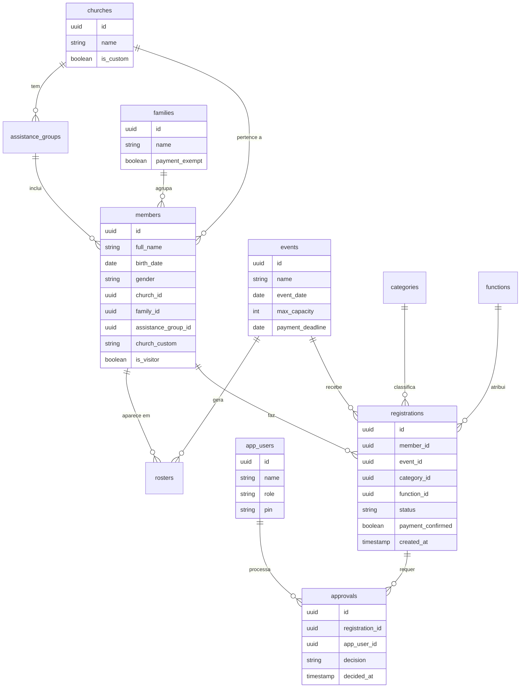

# Modelo de dados

Diagrama de entidades e relacionamentos do banco de dados Supabase (schema v2).

> Este documento é voltado para desenvolvedores. Membros e usuários internos não precisam conhecer esta estrutura.

---

## Entidades e relacionamentos

