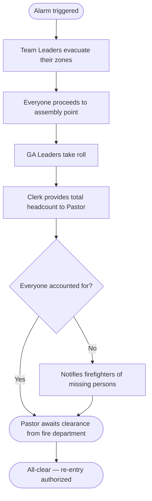

# Evacuation Plan — Philadelphia

> ⚠️ This document is for internal staff use. Keep a printed copy available during the event.

---

## Assembly point

**[TO BE CONFIRMED]** — The garage patio must not be used as the assembly point during the event (parked cars are a fire hazard and block emergency vehicle access). Confirm an alternative point before the event (e.g., the sidewalk in front of the building or the far end of the parking lot, away from the structure).

---

## Responsibilities by role

| Role | Responsibility |
|---|---|
| **Pastor** | Incident commander — calls 911, coordinates with emergency services, gives the all-clear |
| **Team Leaders** | Zone wardens — sweep and clear their assigned area, last to leave their zone |
| **GA Leaders** | Accountability officers at the assembly point — check group members against the printed roster |
| **Clerk** | Brings the printed registration list to the assembly point, provides total headcount to the Pastor |

---

## Evacuation procedure

1. **Trigger the alarm** — use the fire alarm or alert verbally and loudly
2. **Call 911** — the Pastor or designated person calls immediately
3. **Team Leaders evacuate their zones** — calmly and in order, direct everyone to the nearest exits; check bathrooms and closed areas; are the last to leave their zone
4. **Do not use elevators**
5. **Proceed to the assembly point** — everyone goes directly to the designated assembly point
6. **GA Leaders take roll** — check group members against the printed roster; report to the Pastor anyone who is missing
7. **Clerk provides total headcount** — total confirmed registered attendees present
8. **No re-entry** — until the Pastor or competent authority gives the all-clear

---

## Minors

All members registered in the **0-3, Criança, Intermediário, and Adolescente** categories must have an emergency contact recorded in the system. During an evacuation:

- Minors stay with their guardian or GA Leader until the guardian collects them
- The GA Leader uses the printed roster to verify all minors in the group are accompanied
- If a minor is not found, notify the Pastor immediately

---

## Emergency exits

> Map the exits before each event and fill in below.

- Main exit: [TO BE CONFIRMED]
- Secondary exit: [TO BE CONFIRMED]
- Additional emergency exit: [TO BE CONFIRMED]

---

## How to print GA rosters

1. Open the **Admin** panel
2. Go to **Teams** → select the GA group
3. Print the attendance list before the event starts
4. Hand a copy to each GA Leader

---

## Evacuation flow

