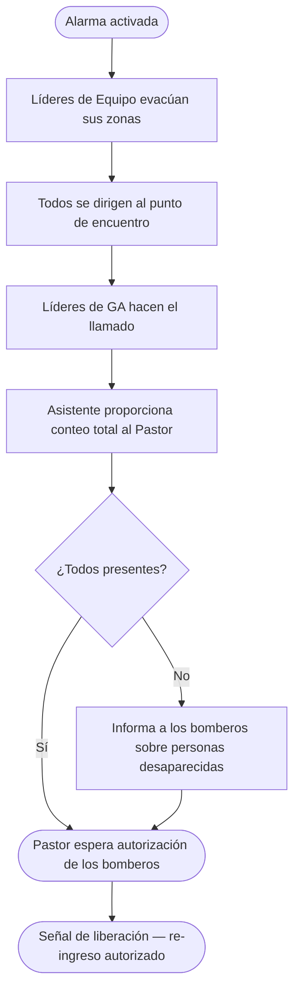

# Plan de Evacuación — Filadelfia

> ⚠️ Este documento es para uso del equipo interno. Mantén una copia impresa disponible durante el evento.

---

## Punto de encuentro

**[POR CONFIRMAR]** — El patio del garaje no debe usarse como punto de encuentro durante el evento (los autos estacionados representan un riesgo de incendio y bloquean el acceso de vehículos de emergencia). Confirma un punto alternativo antes del evento (ej: la acera frente al edificio o el extremo del estacionamiento, lejos de la estructura).

---

## Responsabilidades por perfil

| Perfil | Responsabilidad |
|---|---|
| **Pastor** | Comandante del incidente — llama al 911, coordina con los servicios de emergencia, da la señal de liberación |
| **Líderes de Equipo** | Responsables de zona — despeja y libera su área, es el último en salir de su zona |
| **Líderes de GA** | Responsables de control en el punto de encuentro — verifica los miembros de su grupo contra la lista impresa |
| **Asistente** | Lleva la lista de inscritos impresa al punto de encuentro y proporciona el conteo total al Pastor |

---

## Procedimiento de evacuación

1. **Activa la alarma** — usa la alarma de incendio o avisa verbalmente en voz alta
2. **Llama al 911** — el Pastor o la persona designada llama de inmediato
3. **Líderes de Equipo evacúan sus zonas** — de forma calmada y ordenada, orientan a todos hacia las salidas más cercanas; revisan baños y áreas cerradas; son los últimos en salir de su zona
4. **No uses los elevadores**
5. **Dirígete al punto de encuentro** — todos van directamente al punto de encuentro designado
6. **Líderes de GA hacen el llamado** — verifican los miembros del grupo contra la lista impresa; reportan al Pastor quién falta
7. **El Asistente proporciona el conteo total** — total de inscritos confirmados presentes
8. **Nadie re-ingresa** — hasta que el Pastor o la autoridad competente dé la señal de liberación

---

## Menores de edad

Todos los miembros registrados en las categorías **0-3, Criança, Intermediário y Adolescente** deben tener un contacto de emergencia registrado en el sistema. En caso de evacuación:

- Los menores permanecen con su responsable o con el Líder de GA hasta que el responsable los recoja
- El Líder de GA usa la lista impresa para verificar que todos los menores del grupo estén acompañados
- Si no se encuentra a un menor, informa al Pastor de inmediato

---

## Salidas de emergencia

> Mapea las salidas antes de cada evento e incluye la información a continuación.

- Salida principal: [POR CONFIRMAR]
- Salida secundaria: [POR CONFIRMAR]
- Salida de emergencia adicional: [POR CONFIRMAR]

---

## Cómo imprimir las listas del GA

1. Accede al panel **Admin**
2. Ve a **Equipos** → selecciona el GA
3. Imprime la lista de asistencia antes del inicio del evento
4. Entrega una copia a cada Líder de GA

---

## Flujo de evacuación

