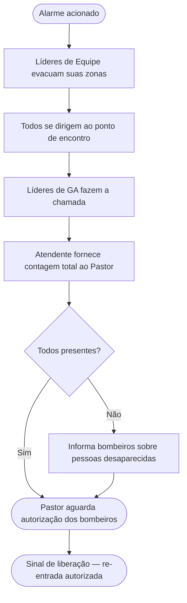

# Plano de Evacuação — Filadélfia

> ⚠️ Este documento é para uso da equipe interna. Mantenha uma cópia impressa disponível durante o evento.

---

## Ponto de encontro

**[A CONFIRMAR]** — O pátio da garagem não deve ser usado como ponto de encontro durante o evento (carros estacionados representam risco e bloqueiam o acesso de emergência). Confirme um ponto alternativo antes do evento (ex: calçada na frente do prédio ou extremidade do estacionamento, longe da estrutura).

---

## Responsabilidades por perfil

| Perfil | Responsabilidade |
|---|---|
| **Pastor** | Comandante do incidente — aciona o 911, coordena com os serviços de emergência, dá o sinal de liberação |
| **Líder de Equipe** | Responsável pela zona — varre e libera sua área, é o último a sair da sua zona |
| **Líder de GA** | Responsável pela prestação de contas no ponto de encontro — confere os membros do seu grupo contra a lista impressa |
| **Atendente** | Leva a lista de inscritos impressa para o ponto de encontro e fornece a contagem total ao Pastor |

---

## Procedimento de evacuação

1. **Acione o alarme** — use o alarme de incêndio ou avise verbalmente em voz alta
2. **Ligue para o 911** — o Pastor ou a pessoa designada liga imediatamente
3. **Líderes de Equipe evacuam suas zonas** — de forma calma e ordenada, orientam todos para as saídas mais próximas; verificam banheiros e áreas fechadas; são os últimos a sair da zona
4. **Não use elevadores**
5. **Dirija-se ao ponto de encontro** — todos vão diretamente para o ponto de encontro designado
6. **Líderes de GA fazem a chamada** — conferem os membros do grupo contra a lista impressa; reportam ao Pastor quem está faltando
7. **Atendente fornece contagem total** — total de inscritos confirmados presentes
8. **Ninguém re-entra** — até o Pastor ou a autoridade competente dar o sinal de liberação

---

## Menores de idade

Todos os membros registrados nas categorias **0-3, Criança, Intermediário e Adolescente** devem ter um contato de emergência registrado no sistema. Em caso de evacuação:

- Menores ficam com seu responsável ou com o Líder de GA até que o responsável os recolha
- O Líder de GA usa a lista impressa para verificar que todos os menores do grupo estão acompanhados
- Se um menor não for encontrado, informe o Pastor imediatamente

---

## Saídas de emergência

> Mapeie as saídas antes de cada evento e inclua esta informação abaixo.

- Saída principal: [A CONFIRMAR]
- Saída secundária: [A CONFIRMAR]
- Saída de emergência adicional: [A CONFIRMAR]

---

## Como imprimir as listas do GA

1. Acesse o painel **Admin**
2. Vá em **Equipes** → selecione o GA
3. Imprima a lista de presença antes do início do evento
4. Entregue uma cópia a cada Líder de GA

---

## Fluxo de evacuação

