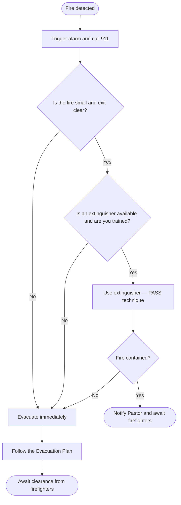

# Fire Response Plan — Philadelphia

> ⚠️ This document is for internal staff use. Keep a printed copy available during the event.

---

## Rule #1: evacuate first

**Never attempt to fight a fire that is out of control, blocks your exit, or produces heavy smoke.** Evacuate immediately and let the firefighters handle it.

Use an extinguisher only if **all** of these are true:
- The fire is small and just starting
- You have an exit behind you
- You have already called 911
- You have been trained to use an extinguisher

---

## In case of fire

1. **Trigger the alarm** immediately
2. **Call 911** — don't assume someone else already did
3. **Begin evacuation** — follow the [Evacuation Plan](evacuation.md)
4. **Attempt to fight** only if safe (see rule above)
5. **Close doors** as you leave — slows the spread of fire
6. **Never re-enter** the building until cleared by firefighters

---

## Fire extinguisher locations

> Map the extinguishers before each event and fill in the table below.

| Extinguisher | Location | Type |
|---|---|---|
| 1 | [TO BE CONFIRMED] | [TO BE CONFIRMED] |
| 2 | [TO BE CONFIRMED] | [TO BE CONFIRMED] |
| 3 | [TO BE CONFIRMED] | [TO BE CONFIRMED] |

---

## How to use a fire extinguisher (PASS)

```
P — Pull the safety pin
A — Aim the nozzle at the base of the flames
S — Squeeze the handle
S — Sweep side to side
```

Stay at least **6 feet (2 meters)** away and keep an exit behind you.

---

## Designated fire warden

The Pastor designates, before each event, **one Team Leader** as the fire warden. This person:
- Knows the location of all extinguishers
- Is the only one authorized to attempt to fight a fire (if safe)
- After using or inspecting an extinguisher, notifies the Pastor

---

## Fire response flow


