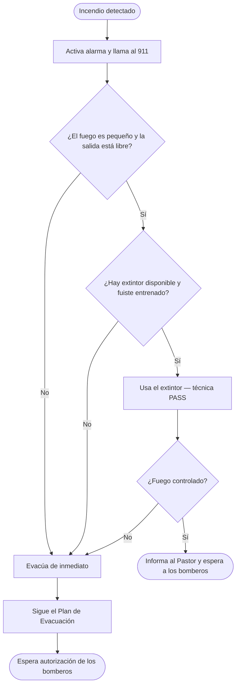

# Plan de Respuesta a Incendios — Filadelfia

> ⚠️ Este documento es para uso del equipo interno. Mantén una copia impresa disponible durante el evento.

---

## Regla número 1: evacúa primero

**Nunca intentes apagar un incendio que esté fuera de control, que bloquee la salida o que produzca mucho humo.** Evacúa de inmediato y deja el combate a los bomberos.

Usa el extintor solo si **todos** estos criterios se cumplen:
- El fuego es pequeño y está en sus inicios
- Tienes una salida detrás de ti
- Ya llamaste al 911
- Fuiste entrenado para usar el extintor

---

## En caso de incendio

1. **Activa la alarma** de inmediato
2. **Llama al 911** — no asumas que alguien ya lo hizo
3. **Inicia la evacuación** — sigue el [Plan de Evacuación](evacuation.md)
4. **Intenta apagar** solo si es seguro (ver regla arriba)
5. **Cierra las puertas** al salir — ralentiza la propagación del fuego
6. **Nunca re-ingreses** al edificio hasta que los bomberos lo autoricen

---

## Ubicación de los extintores

> Mapea los extintores antes de cada evento y completa la tabla a continuación.

| Extintor | Ubicación | Tipo |
|---|---|---|
| 1 | [POR CONFIRMAR] | [POR CONFIRMAR] |
| 2 | [POR CONFIRMAR] | [POR CONFIRMAR] |
| 3 | [POR CONFIRMAR] | [POR CONFIRMAR] |

---

## Cómo usar un extintor (PASS)

```
P — Jala el seguro
A — Apunta la manguera a la base de las llamas
S — Aprieta la palanca
S — Barre de un lado al otro
```

Mantén al menos **2 metros** de distancia y ten una salida detrás de ti.

---

## Responsable de combate a incendio

El Pastor designa, antes de cada evento, **un Líder de Equipo** como responsable del extintor. Esta persona:
- Conoce la ubicación de todos los extintores
- Es la única autorizada a intentar apagar un incendio (si es seguro)
- Después de usar o inspeccionar el extintor, avisa al Pastor

---

## Flujo de respuesta a incendio


