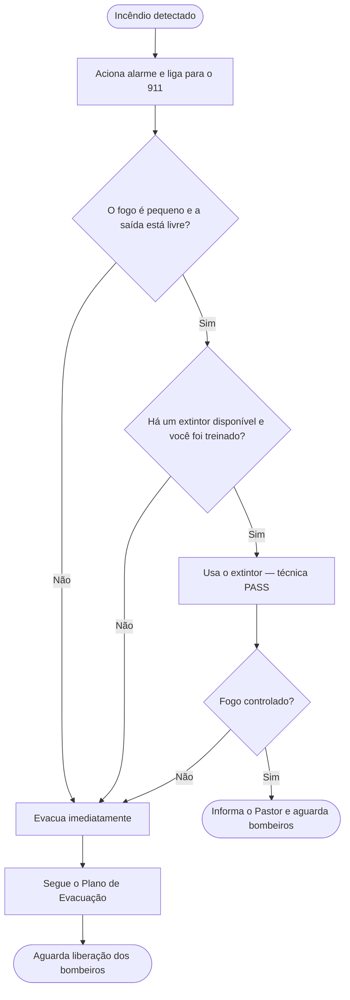

# Plano de Combate a Incêndio — Filadélfia

> ⚠️ Este documento é para uso da equipe interna. Mantenha uma cópia impressa disponível durante o evento.

---

## Regra número 1: evacue primeiro

**Nunca tente apagar um incêndio que esteja fora de controle, que bloqueie a saída ou que produza muita fumaça.** Evacue imediatamente e deixe o combate para os bombeiros.

Use o extintor apenas se **todos** estes critérios forem atendidos:
- O incêndio é pequeno e ainda está no início
- Você tem uma saída atrás de você
- Você já ligou para o 911
- Você foi treinado para usar o extintor

---

## Em caso de incêndio

1. **Acione o alarme** imediatamente
2. **Ligue para o 911** — não presuma que alguém já ligou
3. **Inicie a evacuação** — siga o [Plano de Evacuação](evacuation.md)
4. **Tente apagar** apenas se for seguro (veja regra acima)
5. **Feche as portas** ao sair — retarda a propagação do fogo
6. **Nunca re-entre** no prédio até a liberação dos bombeiros

---

## Localização dos extintores

> Mapeie os extintores antes de cada evento e preencha a tabela abaixo.

| Extintor | Localização | Tipo |
|---|---|---|
| 1 | [A CONFIRMAR] | [A CONFIRMAR] |
| 2 | [A CONFIRMAR] | [A CONFIRMAR] |
| 3 | [A CONFIRMAR] | [A CONFIRMAR] |

---

## Como usar um extintor (PASS)

```
P — Puxe o pino de segurança
A — Aponte a mangueira para a base das chamas
S — Aperte a alavanca
S — Varra de um lado para o outro
```

Fique a pelo menos **2 metros** de distância e mantenha a saída atrás de você.

---

## Responsável pelo combate a incêndio

O Pastor designa, antes de cada evento, **um Líder de Equipe** como responsável pelo extintor. Essa pessoa:
- Conhece a localização de todos os extintores
- É a única autorizada a tentar apagar um incêndio (se seguro)
- Após usar ou inspecionar o extintor, avisa o Pastor

---

## Fluxo de resposta a incêndio


