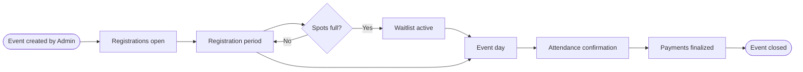
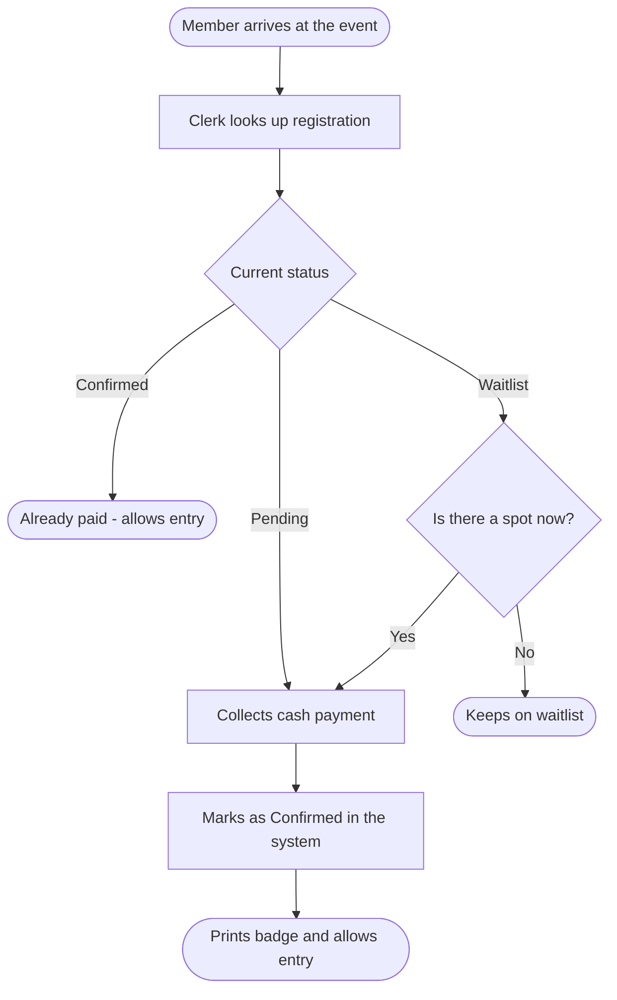
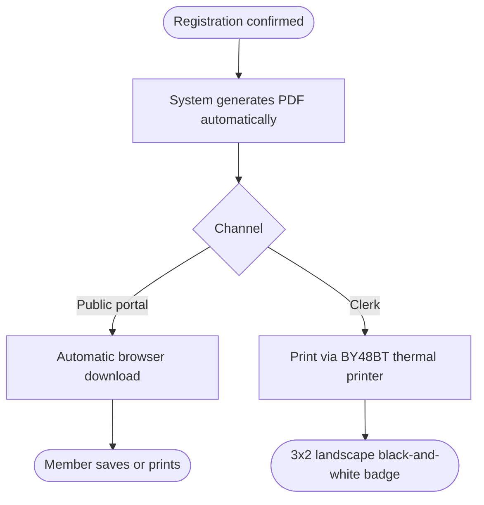

# Event lifecycle

This document describes the phases of an event from creation to close.

---

## Event phases

```mermaid
flowchart LR
    A([Event created by Admin]) --> B[Registrations open]
    B --> C[Registration period]
    C --> D{Spots full?}
    D -->|Yes| E[Waitlist active]
    D -->|No| C
    E --> F[Event day]
    C --> F
    F --> G[Attendance confirmation]
    G --> H[Payments finalized]
    H --> I([Event closed])
```

---

## Payment flow

```mermaid
flowchart TD
    A([Member arrives at the event]) --> B[Clerk looks up registration]
    B --> C{Current status}
    C -->|Pending| D[Collects cash payment]
    C -->|Confirmed| E([Already paid - allows entry])
    C -->|Waitlist| F{Is there a spot now?}
    F -->|Yes| D
    F -->|No| G([Keeps on waitlist])
    D --> H[Marks as Confirmed in the system]
    H --> I([Prints badge and allows entry])
```

---

## Badge generation flow

```mermaid
flowchart TD
    A([Registration confirmed]) --> B[System generates PDF automatically]
    B --> C{Channel}
    C -->|Public portal| D[Automatic browser download]
    C -->|Clerk| E[Print via BY48BT thermal printer]
    D --> F([Member saves or prints])
    E --> G([3x2 landscape black-and-white badge])
```
