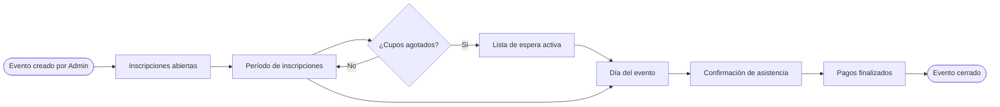
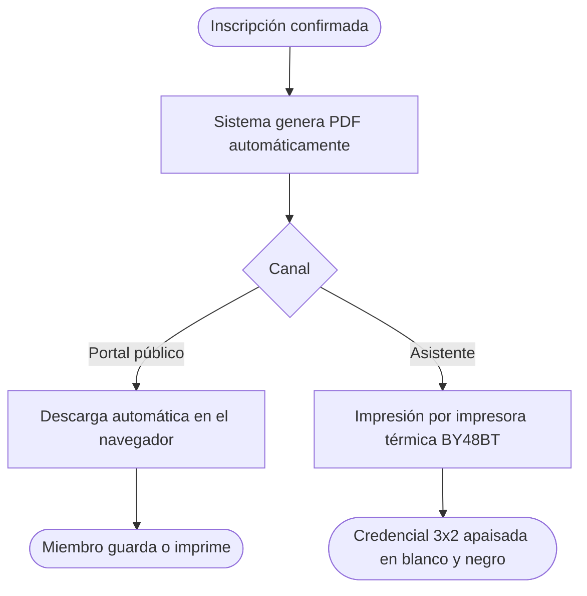

# Ciclo de vida de un evento

Este documento describe las fases de un evento desde su creación hasta el cierre.

---

## Fases del evento

---

## Flujo de pago

```mermaid
flowchart TD
    A([Miembro llega al evento]) --> B[Asistente localiza la inscripción]
    B --> C{Estado actual}
    C -->|Pendiente| D[Cobra el pago en efectivo]
    C -->|Confirmado| E([Ya pagó - permite entrada])
    C -->|Lista de espera| F{¿Hay cupo ahora?}
    F -->|Sí| D
    F -->|No| G([Mantiene en lista de espera])
    D --> H[Marca como Confirmado en el sistema]
    H --> I([Imprime credencial y permite entrada])
```

---

## Flujo de generación de credencial

