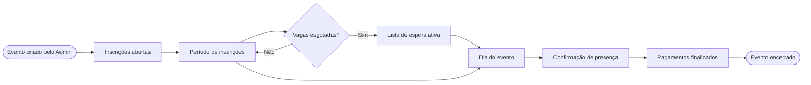
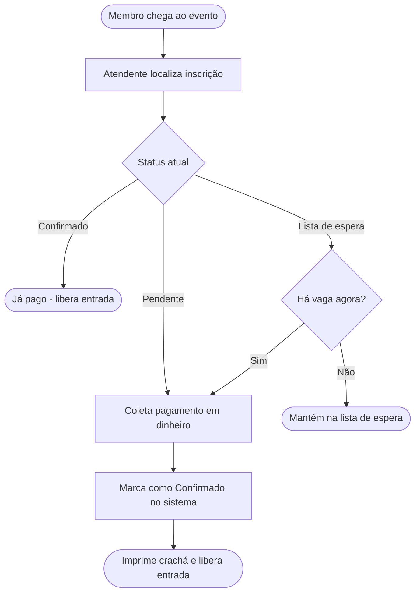
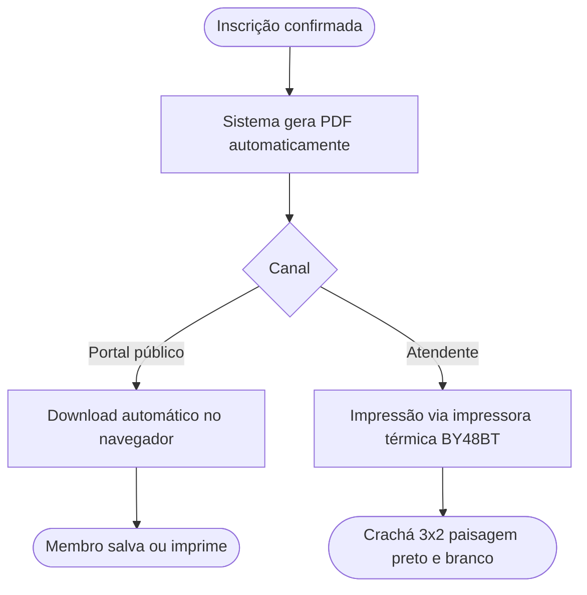

# Ciclo de vida de um evento

Este documento descreve as fases de um evento desde a criação até o encerramento.

---

## Fases do evento

---

## Fluxo de pagamento em dinheiro

---

## Fluxo de geração de crachá

