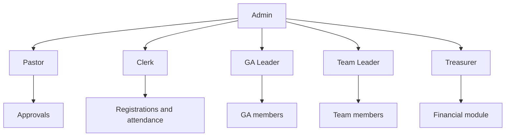
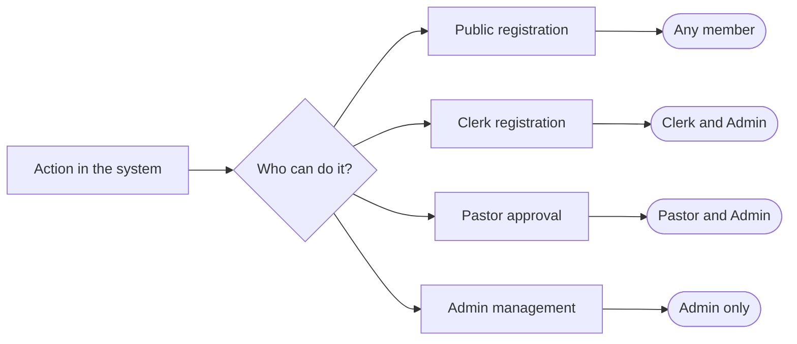

# Roles and access profiles

The system has two types of access: **public** (no PIN) and **internal** (PIN required). Internal access is divided into six profiles, each with specific permissions.

---

## Public access

Available to anyone with the system link. No PIN required.

Allows:
- Registering for events
- Joining the waitlist
- Downloading a PDF badge
- Receiving email confirmation

Does not allow:
- Viewing other members' registrations
- Managing events
- Accessing the internal panel

---

## Internal profiles

### Admin

Full system access.

Can:
- Create and edit events
- View and manage all registrations
- Manage users and PINs
- Import data via CSV
- Configure categories, roles, and churches
- View reports and export data

### Clerk

Support role at the registration desk during events.

Can:
- Register members manually
- View the registration list and payment status
- Mark attendance
- Print badges

Cannot:
- Edit event settings
- Manage users
- Import data

### Pastor

Overview of registrations and approvals.

Can:
- View all event registrations
- Approve or deny registrations that require pastoral approval
- View payment status by family
- View the financial summary (read-only)

Cannot:
- Edit registrations
- Manage settings

### GA Leader (Assistance Group)

Access to their own assistance group's members.

Can:
- View the registered member list for their GA
- Confirm attendance for their GA members
- View payment status for their GA members

Cannot:
- View members of other GAs
- Edit registrations

### Team Leader

Access to their own team members.

Can:
- View their team's member list
- Confirm attendance for their team members

Cannot:
- View other teams
- Edit registrations or settings

### Treasurer

Financial module for the event.

Can:
- View the financial summary (income, expenses, balance)
- View registration payment status (read-only)
- Record and edit expenses (with Google Drive receipt links)
- Record other income (donations, collections, offerings)

Cannot:
- Edit registrations or event settings
- Manage users

---

## Permissions summary

| Action | Public | Clerk | Pastor | GA Leader | Team Leader | Treasurer | Admin |
|---|---|---|---|---|---|---|---|
| Self-registration | ✓ | ✓ | | | | | ✓ |
| Register others | | ✓ | | | | | ✓ |
| View all registrations | | ✓ | ✓ | | | | ✓ |
| View GA registrations | | | | ✓ | | | ✓ |
| View team roster | | | | | ✓ | | ✓ |
| Approve registrations | | | ✓ | | | | ✓ |
| View financial summary | | | ✓ | | | ✓ | ✓ |
| Record expenses / income | | | | | | ✓ | ✓ |
| Manage events | | | | | | | ✓ |
| Manage users | | | | | | | ✓ |
| Import data | | | | | | | ✓ |

---

## Access hierarchy

---

## Permission flow by action

