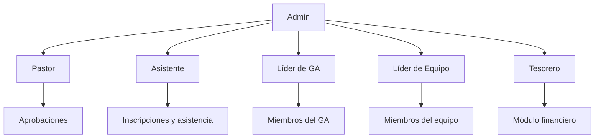
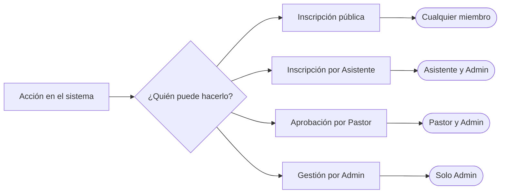

# Funciones y perfiles de acceso

El sistema tiene dos tipos de acceso: **público** (sin PIN) e **interno** (con PIN). El acceso interno se divide en seis perfiles, cada uno con permisos específicos.

---

## Acceso público

Disponible para cualquier persona con el enlace del sistema. No requiere PIN.

Permite:
- Realizar inscripciones en eventos
- Unirse a la lista de espera
- Descargar credencial en PDF
- Recibir confirmación por email

No permite:
- Ver inscripciones de otros miembros
- Administrar eventos
- Acceder al panel interno

---

## Perfiles internos

### Admin

Acceso total al sistema.

Puede:
- Crear y editar eventos
- Ver y administrar todas las inscripciones
- Administrar usuarios y PINs
- Importar datos por CSV
- Configurar categorías, funciones e iglesias
- Ver informes y exportar datos

### Asistente

Perfil de apoyo en el mostrador de atención durante los eventos.

Puede:
- Registrar inscripciones manualmente
- Ver la lista de inscritos y el estado de pago
- Marcar asistencia
- Imprimir credenciales

No puede:
- Editar la configuración del evento
- Administrar usuarios
- Importar datos

### Pastor

Vista general de registros y aprobaciones.

Puede:
- Ver todas las inscripciones del evento
- Aprobar o rechazar registros que requieren aprobación pastoral
- Ver el estado de pago por familia
- Ver el resumen financiero (solo lectura)

No puede:
- Editar inscripciones
- Administrar configuraciones

### Líder de GA (Grupo de Asistencia)

Acceso a los miembros de su propio grupo de asistencia.

Puede:
- Ver la lista de miembros inscritos de su GA
- Confirmar asistencia de los miembros de su GA
- Ver el estado de pago de los miembros de su GA

No puede:
- Ver miembros de otros GAs
- Editar inscripciones

### Líder de Equipo

Acceso a los miembros de su propio equipo de trabajo.

Puede:
- Ver la lista de miembros de su equipo
- Confirmar asistencia de los miembros de su equipo

No puede:
- Ver otros equipos
- Editar inscripciones o configuraciones

### Tesorero

Módulo financiero del evento.

Puede:
- Ver el balance financiero (ingresos, gastos, saldo)
- Ver el estado de pago de las inscripciones (solo lectura)
- Registrar y editar gastos (con enlace de comprobante de Google Drive)
- Registrar otros ingresos (donaciones, colectas, ofrendas)

No puede:
- Editar inscripciones o configuraciones del evento
- Administrar usuarios

---

## Resumen de permisos

| Acción | Público | Asistente | Pastor | Líder GA | Líder Equipo | Tesorero | Admin |
|---|---|---|---|---|---|---|---|
| Inscripción propia | ✓ | ✓ | | | | | ✓ |
| Inscripción de terceros | | ✓ | | | | | ✓ |
| Ver todas las inscripciones | | ✓ | ✓ | | | | ✓ |
| Ver inscripciones del GA | | | | ✓ | | | ✓ |
| Ver inscripciones del equipo | | | | | ✓ | | ✓ |
| Aprobar inscripciones | | | ✓ | | | | ✓ |
| Ver balance financiero | | | ✓ | | | ✓ | ✓ |
| Registrar gastos / ingresos | | | | | | ✓ | ✓ |
| Administrar eventos | | | | | | | ✓ |
| Administrar usuarios | | | | | | | ✓ |
| Importar datos | | | | | | | ✓ |

---

## Jerarquía de acceso

---

## Flujo de permisos por acción

