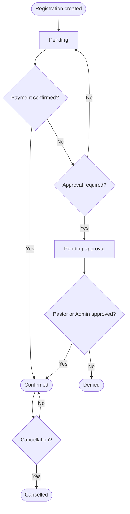
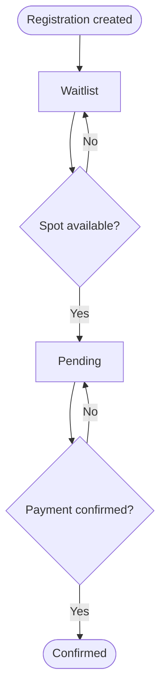

# Registration statuses

Each registration in the system has a status that indicates where it is in the process. Understanding these statuses helps you know what needs attention.

---

## Possible statuses

### Pending

The registration was created but is still waiting for some action — usually payment confirmation or approval.

**Who sees it:** Clerk, Pastor, Admin  
**Next action:** Await payment or approval

---

### Confirmed

The registration is confirmed. Payment has been recorded (if applicable) and there are no pending items.

**Who sees it:** All internal profiles  
**Next action:** None — registration is complete

---

### Waitlist

The event is full. The member was added to the waitlist and will be notified if a spot opens.

**Who sees it:** Clerk, Admin  
**Next action:** Await a spot opening or another member cancelling

---

### Pending approval

The registration requires approval from a Pastor or Admin before it can be confirmed.

**Who sees it:** Pastor, Admin  
**Next action:** Pastor or Admin approves or denies

---

### Denied

The registration was denied after review.

**Who sees it:** Clerk, Pastor, Admin  
**Next action:** Notify the member of the reason for denial (outside the system)

---

### Cancelled

The registration was cancelled, either by the member or by staff.

**Who sees it:** Admin  
**Next action:** If the spot was freed, the next person on the waitlist is promoted automatically

---

## Status flow — normal registration

## Status flow — waitlist

