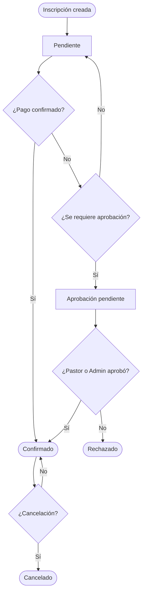
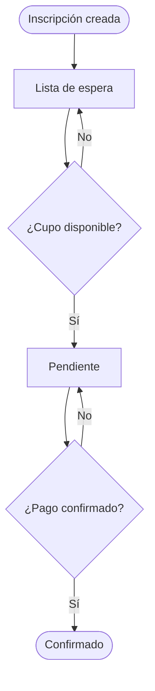

# Estados de inscripción

Cada inscripción en el sistema tiene un estado que indica en qué punto del proceso se encuentra. Entender estos estados ayuda a saber qué necesita atención.

---

## Estados posibles

### Pendiente

La inscripción fue creada pero aún espera alguna acción — generalmente confirmación de pago o aprobación.

**Quién lo ve:** Asistente, Pastor, Admin  
**Próxima acción:** Esperar pago o aprobación

---

### Confirmado

La inscripción está confirmada. El pago fue registrado (si aplica) y no hay elementos pendientes.

**Quién lo ve:** Todos los perfiles internos  
**Próxima acción:** Ninguna — inscripción completa

---

### Lista de espera

El evento está sin cupos. El miembro fue agregado a la lista de espera y será notificado si se abre un cupo.

**Quién lo ve:** Asistente, Admin  
**Próxima acción:** Esperar que se abra un cupo o que otro inscrito cancele

---

### Aprobación pendiente

La inscripción requiere aprobación de un Pastor o Admin antes de ser confirmada.

**Quién lo ve:** Pastor, Admin  
**Próxima acción:** El Pastor o Admin aprueba o rechaza

---

### Rechazado

La inscripción fue rechazada después de revisión.

**Quién lo ve:** Asistente, Pastor, Admin  
**Próxima acción:** Comunicar al miembro el motivo del rechazo (fuera del sistema)

---

### Cancelado

La inscripción fue cancelada, ya sea por el miembro o por el equipo.

**Quién lo ve:** Admin  
**Próxima acción:** Si el cupo fue liberado, el siguiente en la lista de espera es promovido automáticamente

---

## Flujo de estados — inscripción normal

## Flujo de estados — lista de espera

