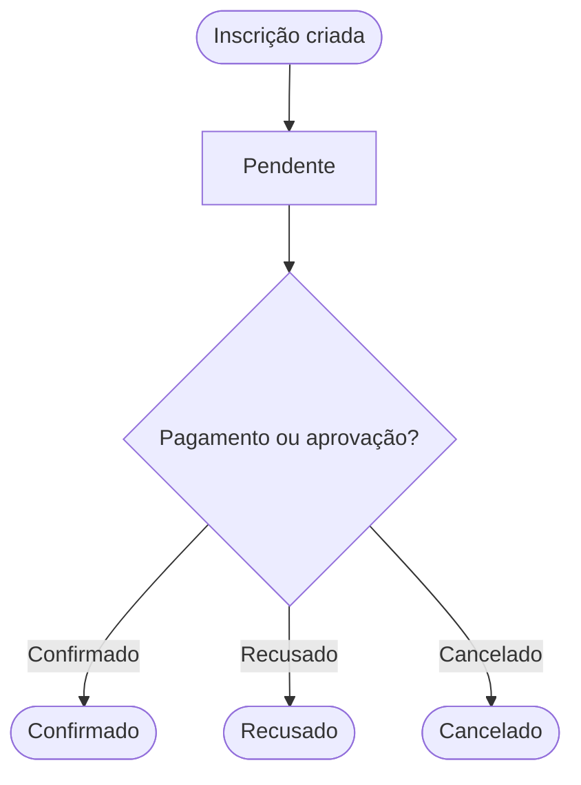
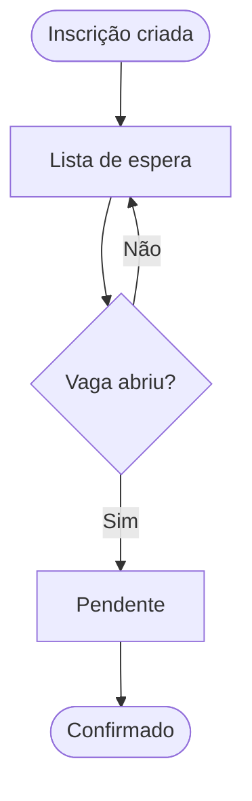

# Status de inscrição

Cada inscrição no sistema tem um status que indica em que ponto do processo ela está. Entender esses status ajuda a saber o que precisa de atenção.

---

## Status possíveis

### Pendente
A inscrição foi criada mas ainda aguarda alguma ação — geralmente confirmação de pagamento ou aprovação.

**Quem vê:** Atendente, Pastor, Admin  
**Próxima ação:** Aguardar pagamento ou aprovação

---

### Confirmado
A inscrição está confirmada. O pagamento foi registrado (se aplicável) e não há pendências.

**Quem vê:** Todos os perfis internos  
**Próxima ação:** Nenhuma — inscrição completa

---

### Lista de espera
O evento está com vagas esgotadas. O membro foi adicionado à lista de espera e será notificado se uma vaga abrir.

**Quem vê:** Atendente, Admin  
**Próxima ação:** Aguardar abertura de vaga ou cancelamento de outro inscrito

---

### Aprovação pendente
A inscrição requer aprovação de um Pastor ou Admin antes de ser confirmada.

**Quem vê:** Pastor, Admin  
**Próxima ação:** Pastor ou Admin aprova ou recusa

---

### Recusado
A inscrição foi recusada após revisão.

**Quem vê:** Atendente, Pastor, Admin  
**Próxima ação:** Comunicar o membro sobre o motivo da recusa (fora do sistema)

---

### Cancelado
A inscrição foi cancelada, seja pelo membro ou pela equipe.

**Quem vê:** Admin  
**Próxima ação:** Se a vaga foi liberada, o próximo na lista de espera é promovido automaticamente

---

## Fluxo típico de uma inscrição

```
Inscrição criada
      ↓
  Pendente
      ↓
[Pagamento registrado / Aprovação concedida]
      ↓
  Confirmado
```

Se o evento estiver cheio:
```
Inscrição criada
      ↓
Lista de espera
      ↓
[Vaga aberta]
      ↓
  Pendente → Confirmado
```

---

## Fluxo visual — inscrição normal



## Fluxo visual — lista de espera


