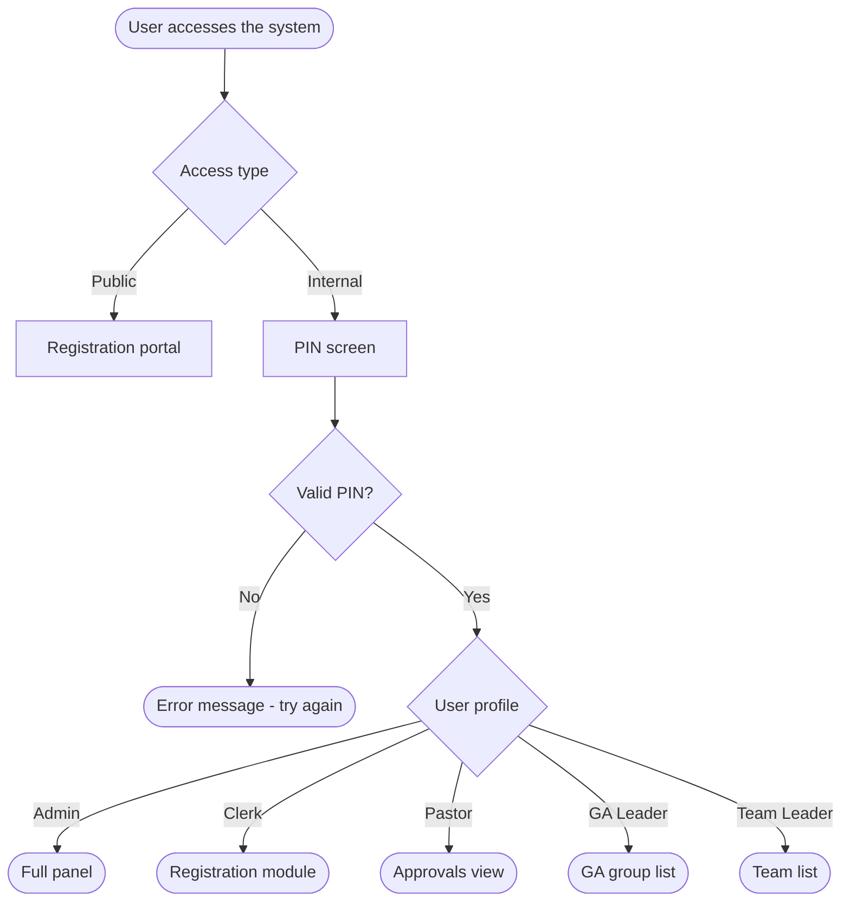

# First login

If this is your first time using the system, this tutorial takes you from zero to your main dashboard in less than 5 minutes.

---

## What you'll need

- A device with internet access (phone, tablet, or computer)
- The system link (provided by event coordination)
- Your access PIN (if you're on the internal team)

> **For members registering publicly:** you don't need a PIN. The registration portal is open — just access the link.

---

## Step 1 — Access the system

Open your browser and go to the link provided by event coordination.

You'll see the home screen with two options:

- **Public registration** — for members registering for an event
- **Internal access** — for staff with a PIN

---

## Step 2 — Choose your access type

**If you're a regular member:**  
Click "Registration" and proceed to the public portal. No PIN required.

**If you're on the internal team:**  
Click "Internal access" and continue to Step 3.

---

## Step 3 — Enter your PIN (internal team)

On the internal access screen, you'll see a field to enter your PIN.

Type your PIN and click **Enter**.

> If you don't know your PIN or it isn't working, see [Reset PIN](../how-to/reset-password.md).

---

## Step 4 — You're in

After logging in, you'll see the dashboard for your profile:

| Profile | What you see |
|---|---|
| Admin | Full panel with all modules |
| Clerk | Registration module and attendance list |
| Pastor | Registration overview and approvals |
| GA Leader | Your group's member list |
| Team Leader | Your team's member list |
| Treasurer | Financial module (Balanço, Expenses, Income) |

---

## Next step

Now that you're in the system, see how to [Register a member](register-member.md) for an event.

---

## PIN access flow

