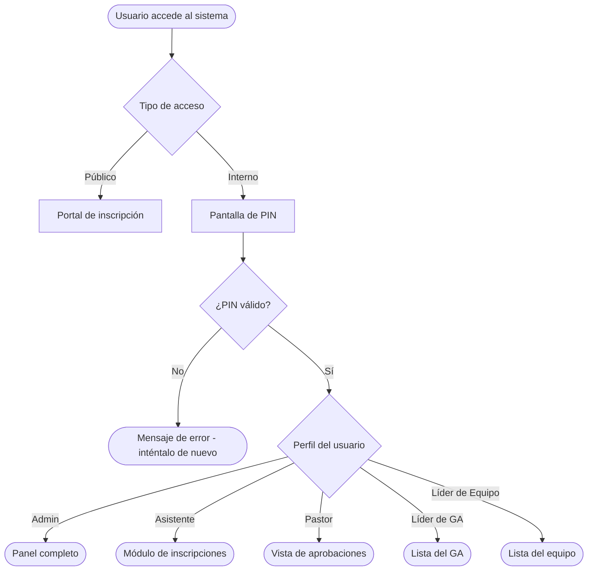

# Primer acceso

Si es la primera vez que usas el sistema, este tutorial te lleva de cero al panel principal en menos de 5 minutos.

---

## Lo que necesitarás

- Un dispositivo con internet (celular, tablet o computadora)
- El enlace del sistema (proporcionado por la coordinación del evento)
- Tu PIN de acceso (si eres del equipo interno)

> **Solo para miembros que se inscriben públicamente:** no necesitas PIN. El portal de inscripción es abierto — solo accede al enlace.

---

## Paso 1 — Accede al sistema

Abre el navegador y accede al enlace proporcionado por la coordinación.

Verás la pantalla de inicio con dos opciones:

- **Inscripción pública** — para miembros que se inscriben en un evento
- **Acceso interno** — para el equipo con PIN

---

## Paso 2 — Elige tu tipo de acceso

**Si eres un miembro común:**  
Haz clic en "Inscripción" y ve al portal público. No necesitas PIN.

**Si eres del equipo interno:**  
Haz clic en "Acceso interno" y continúa al Paso 3.

---

## Paso 3 — Ingresa tu PIN (equipo interno)

En la pantalla de acceso interno, verás un campo para ingresar tu PIN.

Escribe los números de tu PIN y haz clic en **Entrar**.

> Si no sabes tu PIN o no está funcionando, consulta [Restablecer PIN](../how-to/reset-password.md).

---

## Paso 4 — Ya estás dentro

Después de ingresar, verás el panel correspondiente a tu perfil:

| Perfil | Lo que ves |
|---|---|
| Admin | Panel completo con todos los módulos |
| Asistente | Módulo de inscripciones y lista de asistencia |
| Pastor | Vista general de registros y aprobaciones |
| Líder de GA | Lista de miembros de tu grupo |
| Líder de Equipo | Lista de tu equipo |
| Tesorero | Módulo financiero (Balance, Gastos, Ingresos) |

---

## Próximo paso

Ahora que estás dentro del sistema, consulta cómo [Inscribir un miembro](register-member.md) en un evento.

---

## Flujo de acceso con PIN

