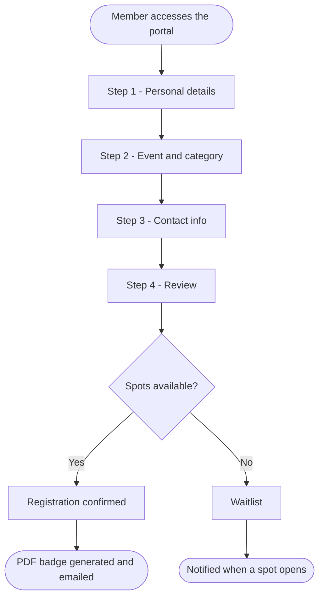
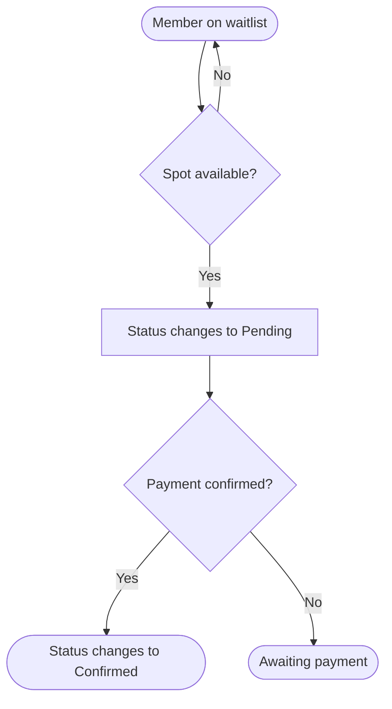

# Register a member

This tutorial shows how to complete a registration through the public portal — the path most members will use.

---

## Before you start

Have the following ready:
- Member's full name
- Home church
- Assistance group (GA), if known
- Contact info (email or phone, if you want a confirmation)

---

## Step 1 — Access the registration portal

Open the system link and click **Registration**.

You'll see the registration form split into 4 steps. You can move forward and back between them before submitting.

---

## Step 2 — Member details (Step 1)

Fill in:
- **Full name**
- **Date of birth** (used to assign the age category automatically)
- **Gender**
- **Home church** — choose from the list. If your church isn't listed, choose "Outra / Not Listed". If you don't have a church, choose "Sem Igreja".

Click **Next**.

---

## Step 3 — Event and category (Step 2)

The system automatically fills in your **age category** based on your date of birth. Verify it looks correct.

Select the **event** you want to register for.

If there are multiple service role options (SGI), choose yours.

Click **Next**.

---

## Step 4 — Contact info (Step 3)

Enter your **email** and/or **phone number** if you want to receive a registration receipt.

> This step is optional but recommended. The receipt is sent to the email you provide and also to event coordination.

Click **Next**.

---

## Step 5 — Review and confirm (Step 4)

Review all the information you entered. If something is wrong, click **Back** to correct it.

If everything looks good, click **Confirm registration**.

---

## Step 6 — Receipt and badge

After confirming, the system will:

1. Show a confirmation message with your registration number
2. Automatically generate a **PDF badge** for download
3. Send a confirmation email (if you provided one)

Click **Download badge** to save or print it.

> If the download doesn't start automatically, check whether your browser is blocking pop-ups and allow the site.

---

## Waitlist registration

If the event is full, you can join the **waitlist**. The process is the same — at the end, you'll see that you were added to the waitlist instead of confirmed.

You'll be notified if a spot opens up.

---

## Having trouble?

See [Login issues](../troubleshooting/login-issues.md) or contact the on-site support team.

---

## Registration flow

## Waitlist flow

