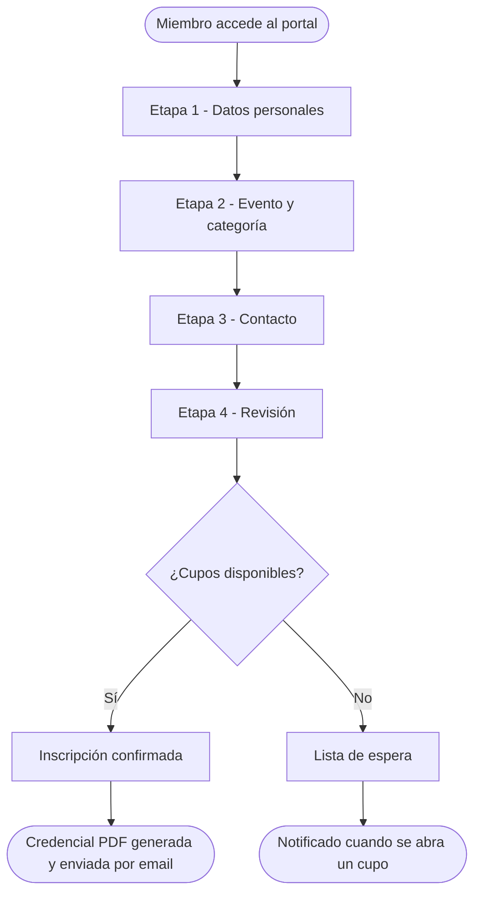
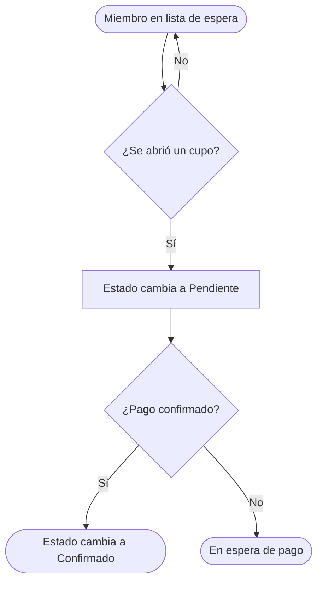

# Inscribir un miembro

Este tutorial muestra cómo completar una inscripción a través del portal público — el camino que usará la mayoría de los miembros.

---

## Antes de comenzar

Ten a mano:
- Nombre completo del miembro
- Iglesia de origen
- Grupo de asistencia (GA), si lo sabes
- Contacto (email o teléfono, si quieres recibir confirmación)

---

## Paso 1 — Accede al portal de inscripción

Abre el enlace del sistema y haz clic en **Inscripción**.

Verás el formulario de inscripción dividido en 4 etapas. Puedes avanzar y retroceder entre ellas antes de confirmar.

---

## Paso 2 — Datos del miembro (Etapa 1)

Completa:
- **Nombre completo**
- **Fecha de nacimiento** (se usa para asignar la categoría automáticamente)
- **Género**
- **Iglesia de origen** — elige de la lista. Si tu iglesia no está en la lista, elige "Outra / Not Listed". Si no tienes iglesia, elige "Sem Igreja".

Haz clic en **Siguiente**.

---

## Paso 3 — Evento y categoría (Etapa 2)

El sistema ya completa la **categoría** automáticamente según la fecha de nacimiento. Verifica que sea correcta.

Selecciona el **evento** en el que deseas inscribirte.

Si hay más de una opción de función (SGI), elige la tuya.

Haz clic en **Siguiente**.

---

## Paso 4 — Contacto (Etapa 3)

Ingresa tu **email** y/o **teléfono** si quieres recibir un comprobante de inscripción.

> Este paso es opcional, pero recomendado. El comprobante se envía al email indicado y también a la coordinación del evento.

Haz clic en **Siguiente**.

---

## Paso 5 — Revisión y confirmación (Etapa 4)

Revisa todos los datos ingresados. Si algo está incorrecto, haz clic en **Atrás** para corregirlo.

Si todo está bien, haz clic en **Confirmar inscripción**.

---

## Paso 6 — Comprobante y credencial

Después de confirmar, el sistema:

1. Muestra un mensaje de confirmación con tu número de inscripción
2. Genera automáticamente una **credencial en PDF** para descargar
3. Envía un email de confirmación (si ingresaste uno)

Haz clic en **Descargar credencial** para guardarla o imprimirla.

> Si la descarga no inicia automáticamente, verifica si tu navegador está bloqueando ventanas emergentes y permite el sitio.

---

## Inscripción en lista de espera

Si el evento está sin cupos disponibles, puedes unirte a la **lista de espera**. El proceso es el mismo — al final, verás que fuiste agregado a la lista en lugar de confirmado.

Serás notificado si se abre un cupo.

---

## ¿Problemas?

Consulta [Problemas de acceso](../troubleshooting/login-issues.md) o contacta al equipo de atención en el lugar.

---

## Flujo de inscripción

## Flujo de lista de espera

