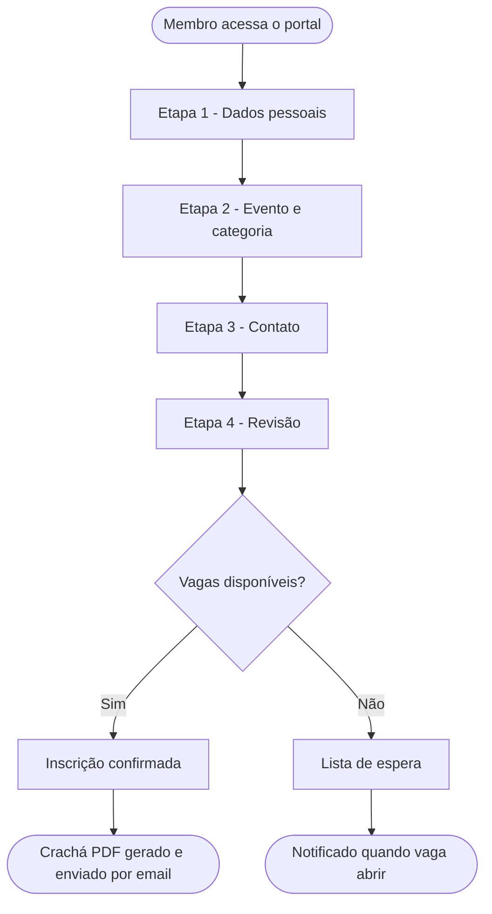
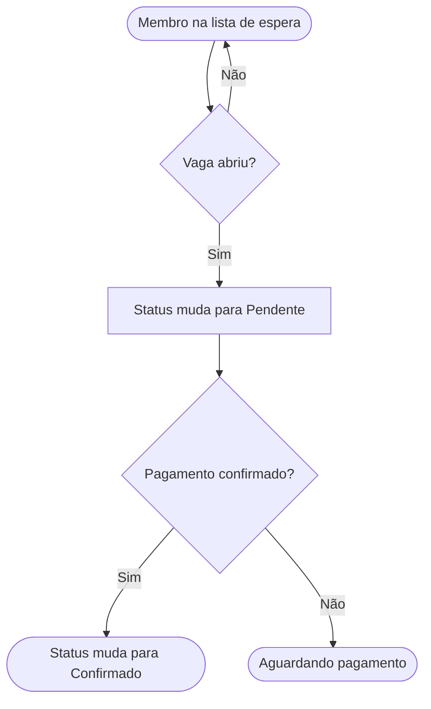

# Inscrever um membro

Este tutorial mostra como completar uma inscrição pelo portal público — o caminho que a maioria dos membros vai usar.

---

## Antes de começar

Tenha em mãos:
- Nome completo do membro
- Igreja de origem
- Grupo de assistência (se souber)
- Contato (email ou telefone, se quiser receber confirmação)

---

## Passo 1 — Acesse o portal de inscrição

Abra o link do sistema e clique em **Inscrição**.

Você vai ver o formulário de inscrição dividido em 4 etapas. Você pode avançar e voltar entre elas antes de confirmar.

---

## Passo 2 — Dados do membro (Etapa 1)

Preencha:
- **Nome completo**
- **Data de nascimento** (usada para definir a categoria automaticamente)
- **Gênero**
- **Igreja de origem** — escolha da lista. Se sua igreja não estiver na lista, escolha "Outra / Not Listed". Se não tiver igreja, escolha "Sem Igreja".

Clique em **Próximo**.

---

## Passo 3 — Evento e categoria (Etapa 2)

O sistema já preenche a **categoria** automaticamente com base na data de nascimento. Confira se está correto.

Selecione o **evento** para o qual deseja se inscrever.

Se houver mais de uma opção de função (SGI), escolha a sua.

Clique em **Próximo**.

---

## Passo 4 — Contato (Etapa 3)

Preencha seu **email** e/ou **telefone** se quiser receber um comprovante de inscrição.

> Este passo é opcional, mas recomendado. O comprovante é enviado para o email informado e também para a coordenação do evento.

Clique em **Próximo**.

---

## Passo 5 — Revisão e confirmação (Etapa 4)

Revise todos os dados preenchidos. Se algo estiver errado, clique em **Voltar** para corrigir.

Se tudo estiver certo, clique em **Confirmar inscrição**.

---

## Passo 6 — Comprovante e crachá

Após confirmar, o sistema:

1. Exibe uma mensagem de confirmação com seu número de inscrição
2. Gera automaticamente um **crachá em PDF** para download
3. Envia um email de confirmação (se você informou um endereço)

Clique em **Baixar crachá** para salvar ou imprimir.

> Se o download não iniciar automaticamente, verifique se o seu navegador está bloqueando pop-ups e libere o site.

---

## Inscrição na lista de espera

Se o evento estiver com vagas esgotadas, você pode entrar na **lista de espera**. O processo é o mesmo — no final, você verá que foi adicionado à lista em vez de confirmado.

Você será notificado se uma vaga abrir.

---

## Problemas?

Veja [Problemas de acesso](../troubleshooting/login-issues.md) ou entre em contato com a equipe de atendimento no local.

---

## Fluxo de inscrição

## Fluxo da lista de espera

